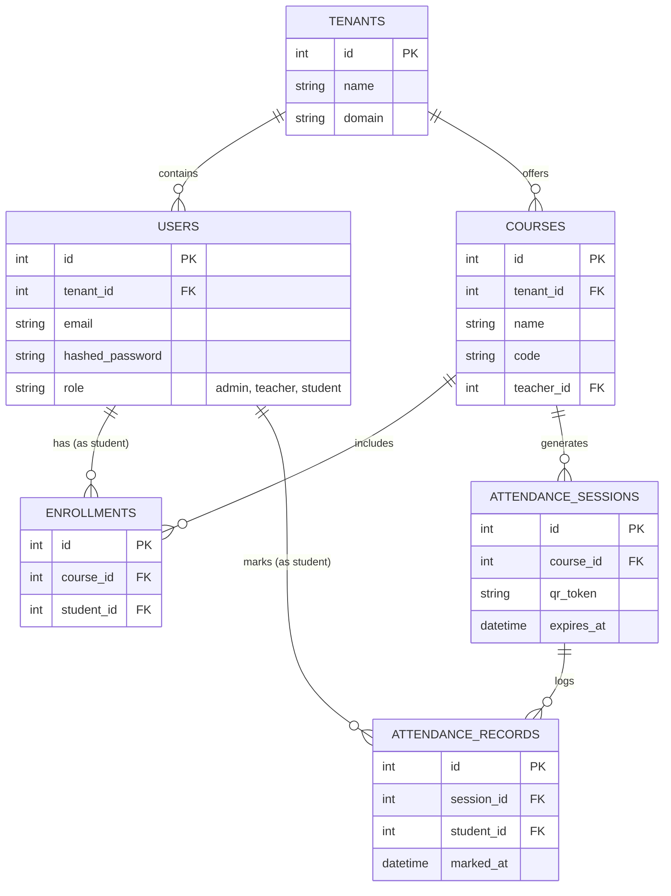

# Attendance Management System (SaaS)

This repository contains the cloud-based Attendance Management System designed for educational institutions, allowing fast, automated, and secure attendance marking via time-limited QR codes.

## Architecture

The system uses a multi-tenant microservices architecture:
- **Backend:** FastAPI (Python), SQLAlchemy, PostgreSQL
- **Frontend (Web):** Next.js (Planned)
- **Frontend (Mobile):** React Native / Flutter (Planned)
- **Infrastructure:** Docker & Docker Compose

## Entity-Relationship Diagram (ERD)



## Setup & Running

This project is fully containerized. You can run the backend and the database with a single command.

1. Ensure Docker and Docker Compose are installed.
2. Run the following command from the root of the project:
   ```bash
   docker-compose up -d --build
   ```
3. The API will be accessible at: `http://localhost:8000`
4. Interactive API Documentation (Swagger) is available at: `http://localhost:8000/docs`
5. The Next.js Web Dashboard will be available at: `http://localhost:3000`

### Mobile App
The student mobile application is located in the `mobile-app` directory (built with React Native & Expo).
To run it locally:
```bash
cd mobile-app
npm install
npx expo start
```
The app includes a QR scanner component that reads the token generated by the Teacher Dashboard and marks attendance via the API.

## Implementation Status (100% Complete)
- [x] Architecture setup and Database schema definition.
- [x] Dockerization of the API and Database.
- [x] Core Authentication APIs (Register/Login).
- [x] SQLAlchemy ORM setup for multi-tenancy.
- [x] Next.js Web Dashboard for Teachers.
- [x] Course Management and QR Code Generation Logic.
- [x] Advanced Reporting APIs.
- [x] React Native (Expo) Mobile App for Students (QR Scanner).
